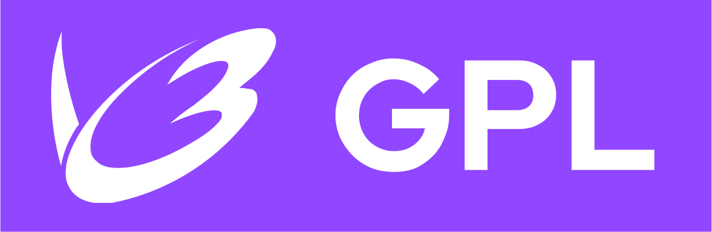

    

<h1 align="center">Twitch Reverse Engineering</h1>

<strong>Towards documentation of the Twitch platform for privacy frontends, software and tools.</strong>

___

    <i>A purple, tree-like, stylized comment bubble with hacker-like code inside, ethereal; Matrix code background</i> made with Stable Diffussion
        <a href="https://huggingface.co/stabilityai/stable-diffusion-xl-base-1.0">a</a> in DreamStudio.
        <a href="https://beta.dreamstudio.ai/generate">b</a>
    

    Twitch's trademark logo is described as a <i>stylized comment bubble</i>,
        <a href="https://tsdr.uspto.gov/documentviewer?caseId=sn86983800&docId=ORC20180506125118&linkId=8">a</a>
        whereby the prompt was inspired from.
    

 &#8287;

     &#8287;
    

 &#8287;

`twre` /twɹi:/ (pronounced as *tree* /tɹi:/) [a](https://en.wiktionary.org/wiki/tree#Pronunciation) is the home for open-source documentation from the reverse engineering of the Twitch platform, and of lightweight and blazing-fast code and tools therefrom.<!--, e.g. stream video and chat downloaders.-->

<h1 align="center">Repositories</h1>

| Name | Description |
| :--- | :--- |
| [`twre-graphql`](https://github.com/LeCodingWolfie/twre-graphql) | Twitch's undocumented GraphQL API, now documented, and openly available (WIP). |
| [`twre-downloader`](https://github.com/LeCodingWolfie/twre) | A blazing-fast Twitch VOD and live stream video and chat downloader and renderer (*to be*). |
| [`twre-frontend`](https://github.com/LeCodingWolfie/twre) | An exceptionally lightweight alternative, privacy-respecting front-end for Twitch (*to be*). |

<h1 align="center"><a href="COPYRIGHT">License</a></h1>

Code is under the GPL 3.0, whereas the documentation and the rest (e.g. text such as the README and `resources/`, with exceptions, e.g. badges' vector files) in CC BY-SA 4.0; nevertheless, there are several exceptions: the logo is waived to the public domain as is Twitch's, as well as the AI banner under CC0. [a](LICENSE) [b](https://creativecommons.org/licenses/by-sa/4.0/) [c](https://creativecommons.org/publicdomain/zero/1.0/) [^1] [^2]

[^1]: As a trademark, the logo is not protected by copyright;
    [a](https://www.uspto.gov/trademarks/basics/trademark-patent-copyright)
    nonetheless, the logo may not be within the scope of copyright at all (i.e. may not meet the threshold of originality,
    [b](https://en.wikipedia.org/wiki/Threshold_of_originality#United_States)
    which may be substantial, at most, modest or low, and is a prerequisite to protection, that thus should not be of trivial authorship)
    (p. 759-760,
    [c](https://papers.ssrn.com/sol3/papers.cfm?abstract_id=3593771)
    cited in *Feist Pub. v. Rural Tel. Serv.*, 499 U. S. 340)
    [d](https://supreme.justia.com/cases/federal/us/499/340/)
    due to the use of common geometric shapes, symbols or design of familiarity with minimal varaition in space, arrangement and linearity, that do not illustrate enough creativity (p. 3-5).
    [e](https://web.archive.org/web/20160412165054/http://ipmall.info/hosted_resources/CopyrightAppeals/2006/Best%20Western%20Logo.pdf)
    
    Compliant with Twitch's Trademark Guidelines,
    <a href="https://www.twitch.tv/p/en/legal/trademark/">a</a>
    the logo refers to Twitch's platform whilist the repository is visually distinguished; and regardless of, trademark infringement may occur, at most, criminalized in the *very limited context of counterfeiting* (i.e. to traffic in with a *mark*, to deceive or cause confusion, with commercial purposes; 18 U.S.C. § 2320
    [b](https://www.law.cornell.edu/uscode/text/18/2320)
    from Pub. L. 98–473, 2178),
    [c](https://www.govinfo.gov/app/details/STATUTE-98/STATUTE-98-Pg1837/summary)
    which constitutes a billion dollar industry (p. 478, 485 & 486).
    [d](https://jolt.law.harvard.edu/articles/pdf/v24/24HarvJLTech469.pdf)

    Furthermore, trademark infringment is established under the Lanham Act that the use is commercial, in connection with the sale or advertising of goods or services, and without consent (15 U.S.C. § 1114, 1125 & 1127),
    [a](https://www.law.cornell.edu/uscode/text/15/1125)
    to cause confusion as to the their affiliation or origin (*1-800 Contacts v. WhenU*, 414 F.3d 400),
    [b](https://law.justia.com/cases/federal/appellate-courts/F3/414/400/622195/)
    whether the mark may be registered or protected by law from popularity and distinctiveness (§ 1125(c); *Time v. Petersen Publishing*, 173 F.3d 113).
    [c](https://law.justia.com/cases/federal/appellate-courts/F3/173/113/548079/)

    All in all, the logo, withdrawn from copyright protection, does not violate the trademark as the use is non-commercial, and is unable to cause confusion with Twitch's platform or any of its products, as is clear from the project's purpose, which is unaffiliated, in any way, with Twitch.

[^2]: AI art is not of human authorship, and therefore is not copyright protected: *Copyright law only protects intellectual labor, founded in the creativity of the human mind*, and is thus limited to *human creations*. [a](https://www.copyright.gov/rulings-filings/review-board/docs/a-recent-entrance-to-paradise.pdf) (nevertheless, the AI copyright issue is widely debated among many fields). [b](https://copyright.gov/ai/ai_policy_guidance.pdf)
___

    
        Twitch's Glitch logo, taken from Wikimedia Commons,
        <a href="https://commons.wikimedia.org/wiki/File:Twitch_Glitch_Logo_Purple.svg">a</a>
        is trademarked in the US by Twitch Interactive, Inc. (registration number 5,476,086 at 22/3/2018);
        <a href="https://tsdr.uspto.gov/documentviewer?caseId=sn86983800&docId=ORC20180506125118&linkId=8">b</a>
        <a href="https://tsdr.uspto.gov/#caseNumber=86983800&caseSearchType=US_APPLICATION&caseType=SERIAL_NO&searchType=statusSearch">c</a>
        therefore, as such, the project's logo is waived to the public domain through a Creative Commons Zero deed (CC0);
        <a href="https://creativecommons.org/publicdomain/zero/1.0/">d</a>
        see the 1st footnote.
    

 

    
        Logo made with Inkscape,
        <a href="https://inkscape.org/">a</a>
        through Indian Type Foundry's
        <a href="https://www.indiantypefoundry.com/">b</a>
        Teko font, found in Google Fonts' GitHub repository.
        <a href="https://github.com/googlefonts/teko">c</a>
    

    
        GPL and CC logos extracted from GNU's
        <a href="https://www.gnu.org/graphics/license-logos.html">a</a>
        and Creative Commons
        <a href="https://creativecommons.org/mission/downloads/#icons">b</a>
        License SVG Logos and Icons respectively.
    

    
        GPL and CC BY-SA badges made with Inkscape,
        through Red Hat's Display Font.
        <a href="https://github.com/RedHatOfficial/RedHatFont">a</a>
        <a href="https://github.com/RedHatOfficial/RedHatFont/blob/master/fonts/proportional/RedHatDisplayVF.ttf">b</a>
        All SVGs were optimized with SVGOMG!.
        <a href="https://github.com/jakearchibald/svgomg">c</a>
    

&#8287;

<!-- 

    
        Compliant with their Trademark Guidelines,
        <a href="https://www.twitch.tv/p/en/legal/trademark/">a</a>
        the logo visually refers to Twitch's platform, with a simple modification to distinguish the repository's purpose.
    

    
        Furthermore, the logo may not be within the scope of copyright protection (i.e. the threshold of originality,
        <a href="https://en.wikipedia.org/wiki/Threshold_of_originality#United_States">a</a>
        which may be substantial, at most, modest or low, is a prerequisite to protection, and thus should not be of trivial authorship) (p. 759-760,
        <a href="https://papers.ssrn.com/sol3/papers.cfm?abstract_id=3593771">b</a>
        cited in <i>Feist Pub. v. Rural Tel. Serv.</i>, 499 U. S. 340),
        <a href="https://supreme.justia.com/cases/federal/us/499/340/">c</a>
        due to the use of common geometric shapes, symbols or design of familiarity with minimal varaition in space, arrangement and linearity (p. 3-5).
        <a href="https://web.archive.org/web/20160412165054/http://ipmall.info/hosted_resources/CopyrightAppeals/2006/Best%20Western%20Logo.pdf">d</a>
    

 -->
